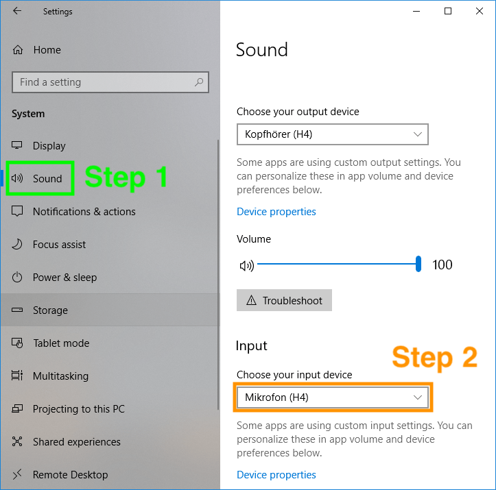
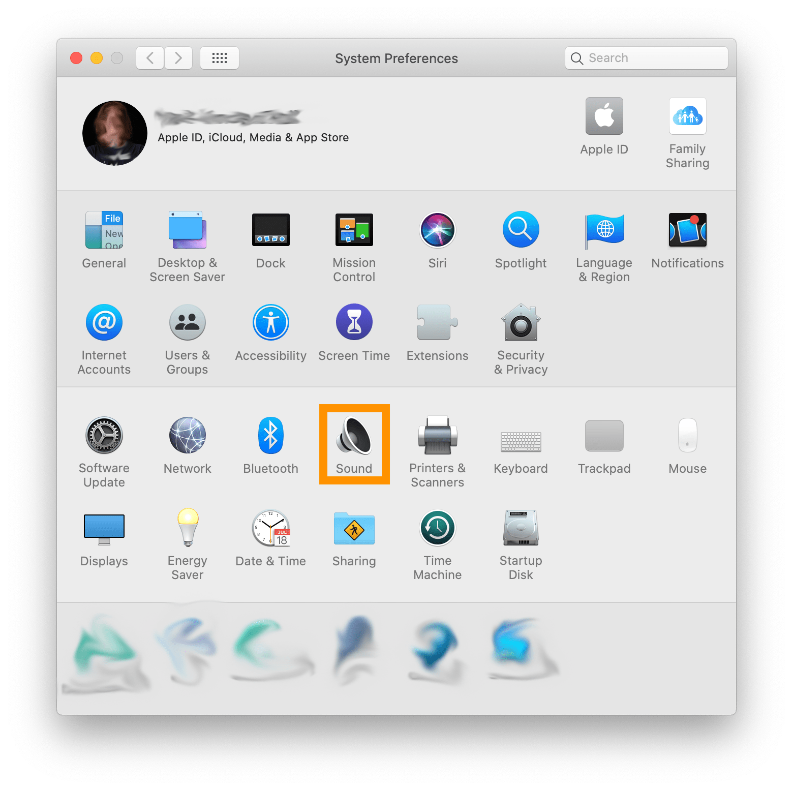
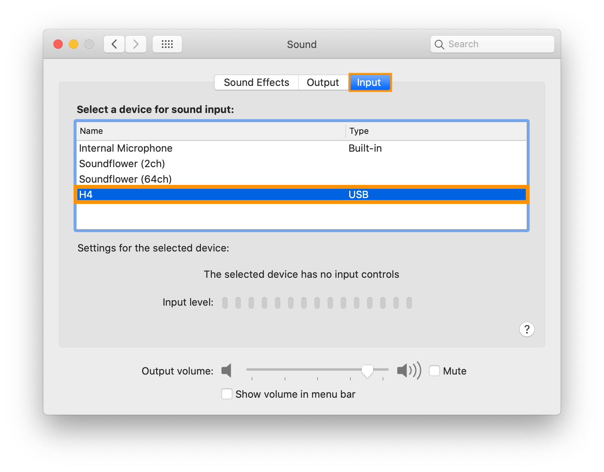

# Configure the Audio Device

## Windows
1. Open the Windows settings.
2. Click on the `System` icon.  

3. Select `Sound` on the right.  
Make sure that your audio interface / microphone is shown in the `Choose your input device` dropdown (it probably has a different name).  

## macOS
1. Open the System Preferences.
2. Click on the `Sound` icon.  

3. Make sure that your audio interface / microphone is shown on the `input` tab (it probably has a different name).  

## Linux
You proably know what you are doing 😶