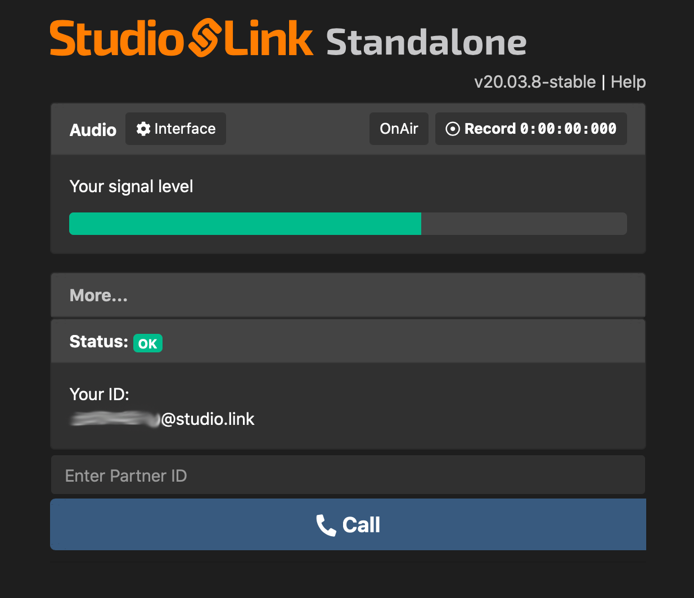
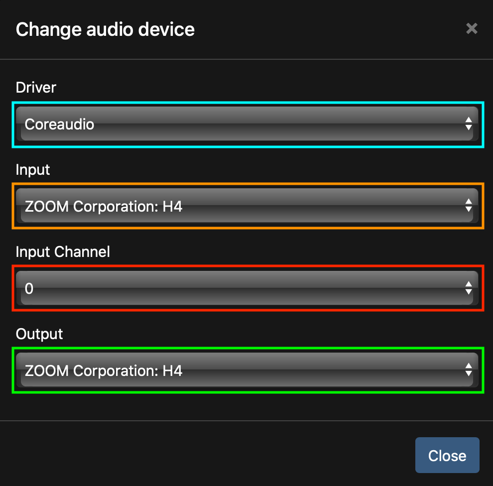
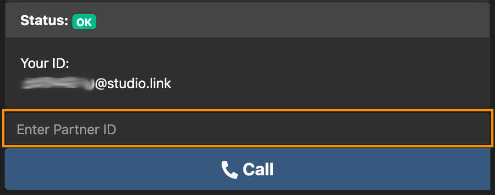
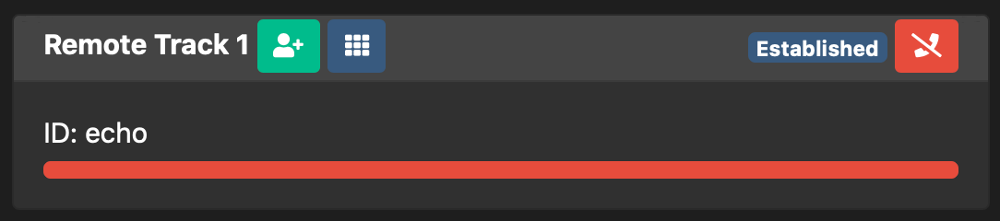

# Studio Link Configuration

1. Start `Studio Link` from your download folder. Your web browser will open the user interface.  
   * **Please note:** Don't close this web browser window / tab. `Studio Link` will be closed if you do.

2. Click on the `Interface` button.

3. A menu with audio interface settings will open.

	* `Driver - blue`: If you don't use Linux you can proably ignore this.
	* `Input - orange`: Select your audio interface / microphone here.
	* `Input Channel - red`: If your interface or microphone has several channels, e.g. a stereo microphone, you can select the channel to be used here. Please check what sounds best.
	* `Output - green`: Select the audio output to which your headphones are connected.
4. To test your configuration, enter `echo` in the marked field and press the call button.

	* You will hear the output from your own microphone. You can also test which channel sounds best in the interface settings now.
	* If you hear feedback (the same sound gets louder and louder), your microphone picks up the output of your speaker. Please make sure that you use headphones. 
