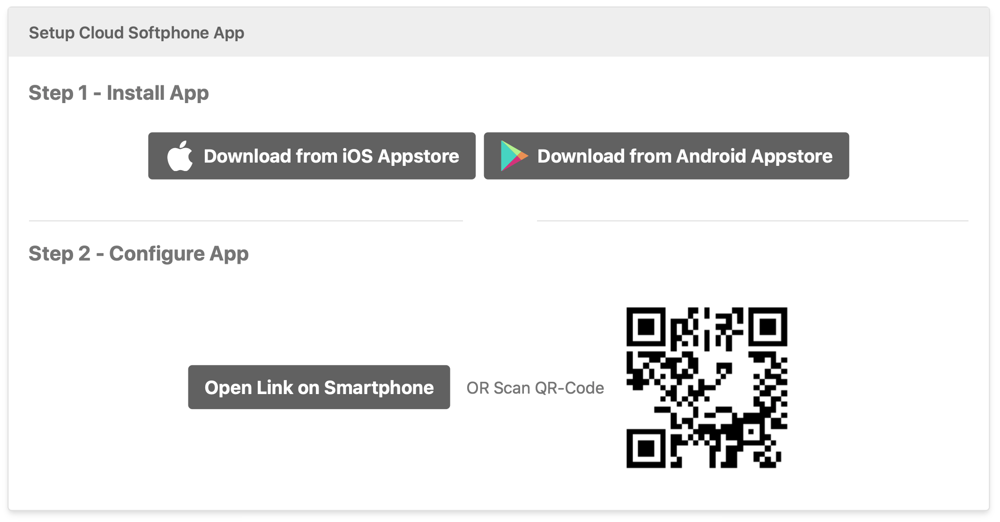
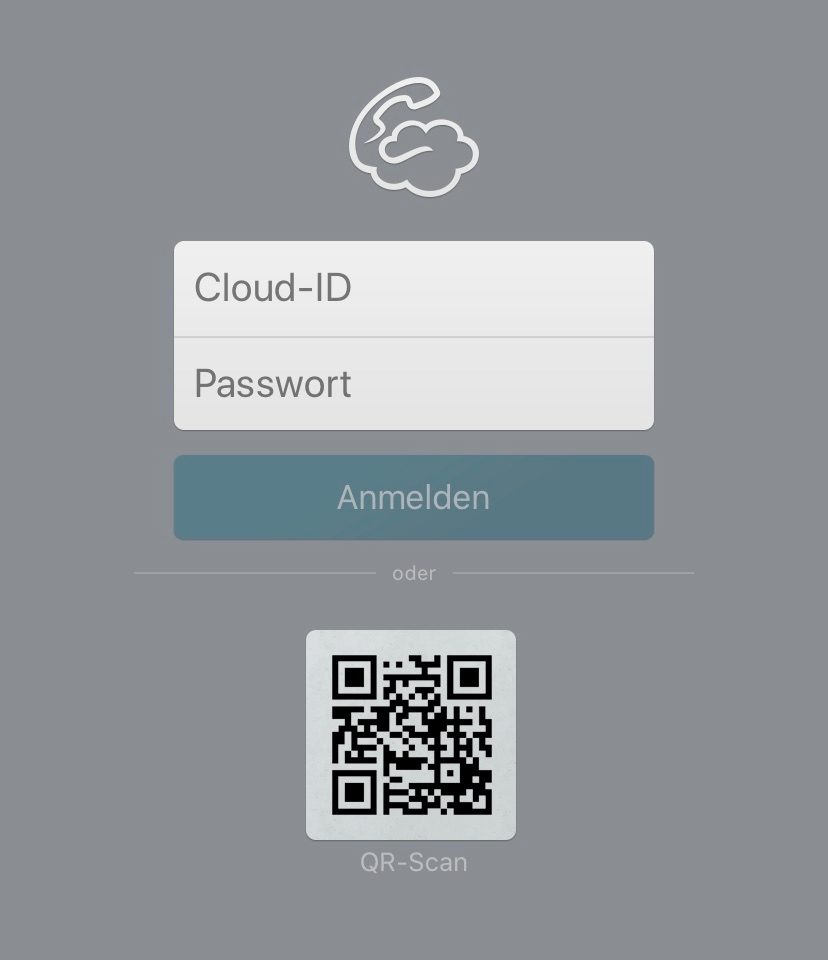
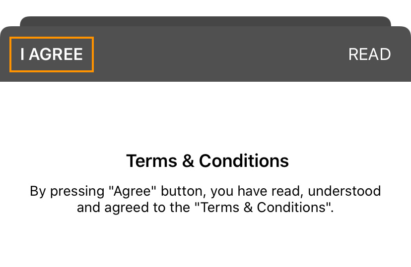
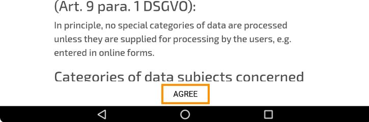
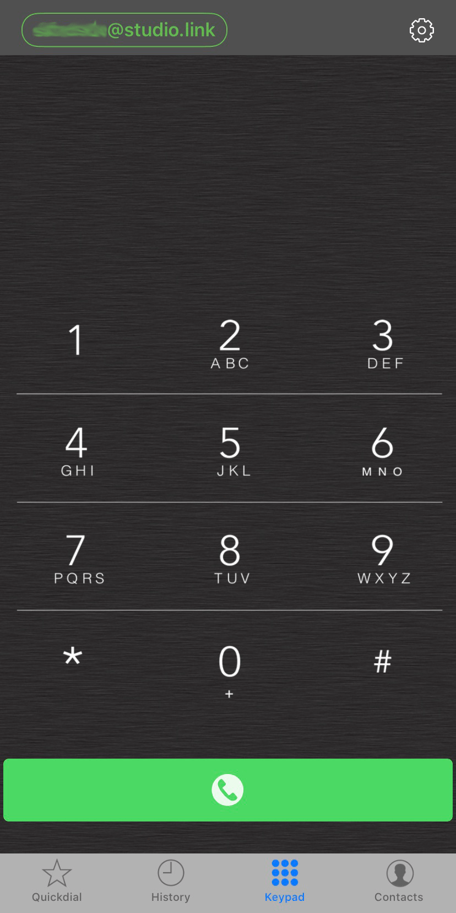

# Mobile Recording

Please let us know if you would like to record by mobile phone. We will then send you a personal link with which you can configure your device.

**This is what your invitation will look like:**

To get started, download the `Softphone` app using one of the download links at the top of the page.

--- 
If you have opened the invitation on your smartphone you can configure the app with the button `Open Link on Smartphone`. Otherwise you can also open `Softphone` directly and scan the QR code in the invitation.  

---
To continue, please accept Studio Link's privacy policy on the top left.   
 
On Android the agree button is at the bottom.  

---

You should be seeing something like this now. Make sure that your ID in the upper left corner is outlined in green like in the picture. On Android it looks a bit different, but is the same overall.
