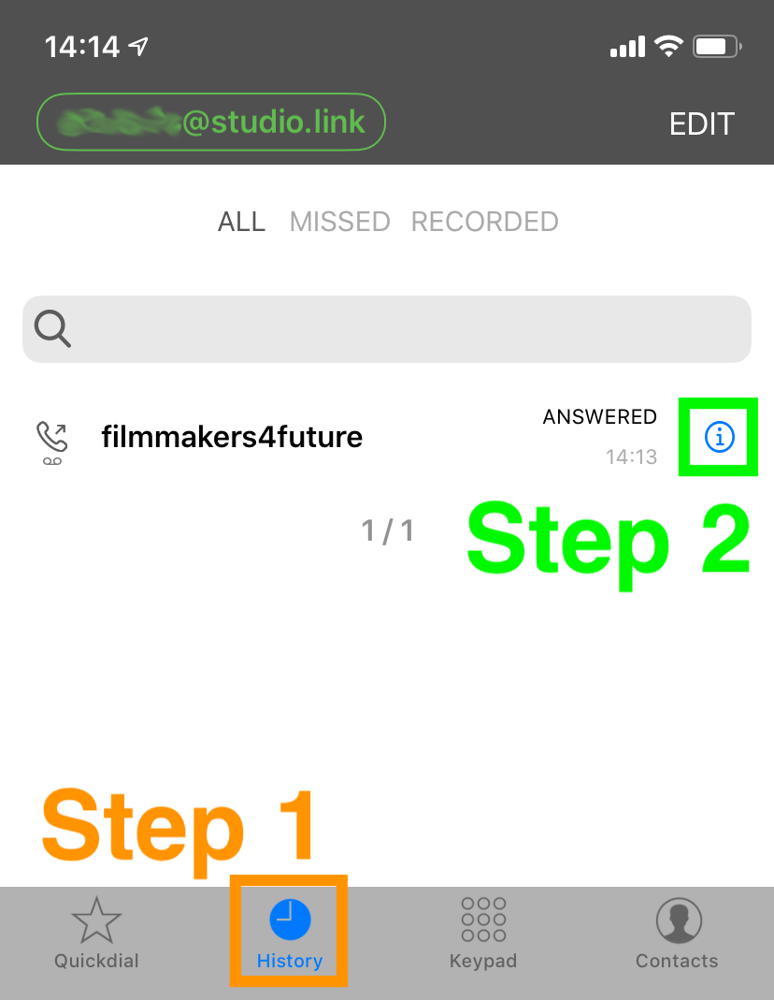

# Send Backup Recording
After the show has ended, we would like to ask you to send us your backup recording.

## On iOS
1. Use the `History` button at the bottom of the screen to go to the call history.  
Then tap on the `i` next to our call.  

2. Tap on the `i` next to the recording of the call.  

2. Tap on `Send by Email`.  

2. Enter the  address `podcast@filmmakersforfuture.org` and send the email.  

## On Android
1. Tap the `History` icon at the top of the screen to go to the call history.  
Then tap on the `i` next to our call.  

2. Tap on the `dots` next to the recording of the call. Then tap `Share`.

3. Send the file to `podcast@filmmakersforfuture.org`.  