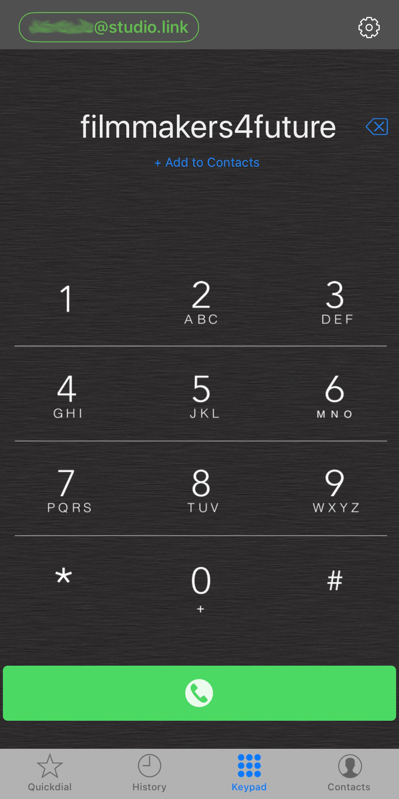
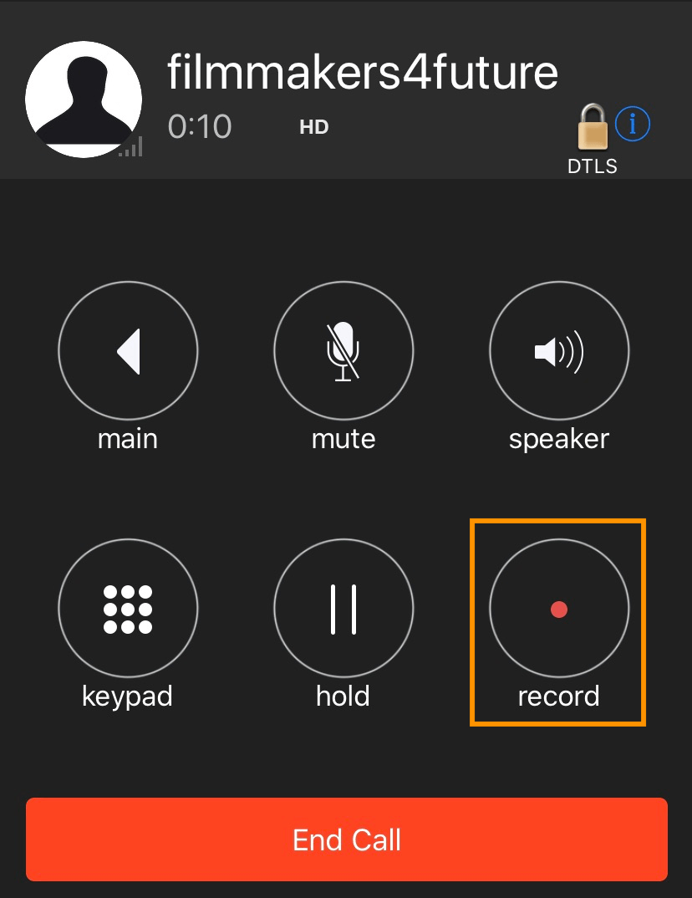
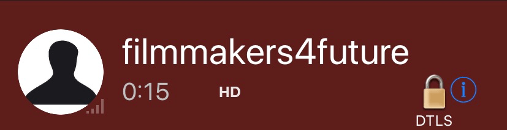
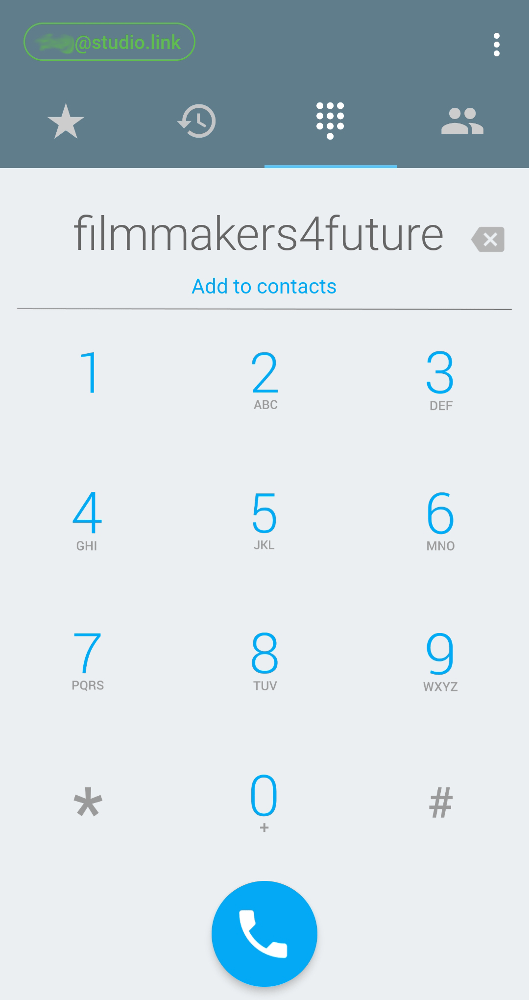
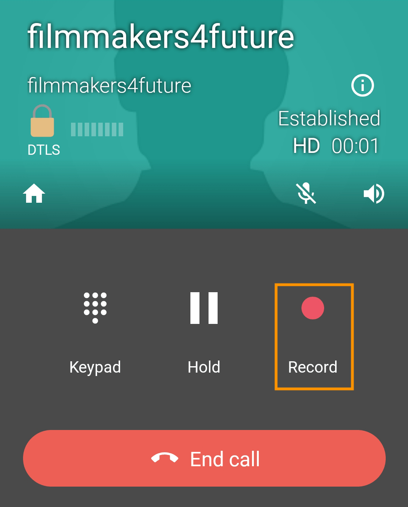
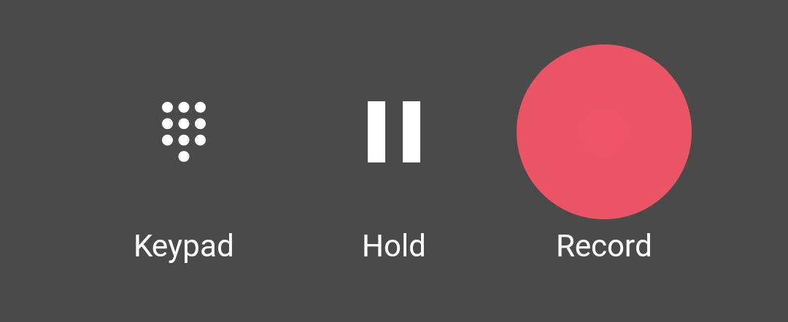

# Call our Studio

## On iOS
1. Tap on the empty area above the numpad. A keyboard will appear, type `filmmakers4future` and hit `enter` on the keyboard.
2. With the green call button you can now call our studio. 
	* **Please note:** The call only works if our studio is online.

3. The phone will keep ringing until our studio answers the call.
4. Please press the record button when we tell you to. This will create a local backup recording on your device in case of connection issues.  

	* When a recording is in progress, the top bar turns red.
	
5. You can now put your device aside and focus on our conversation.

## On Android
1. Tap on the empty area above the numpad. A keyboard will appear, type `filmmakers4future` and hit `enter` on the keyboard.
2. With the blue call button you can now call our studio. 
	* **Please note:** The call only works if our studio is online.

3. The phone will keep ringing until our studio answers the call.
4. Please press the record button when we tell you to. This will create a local backup recording on your device in case of connection issues.  

	* When a recording is in progress, the button is highlighted.
	
5. You can now put your device aside and focus on our conversation.