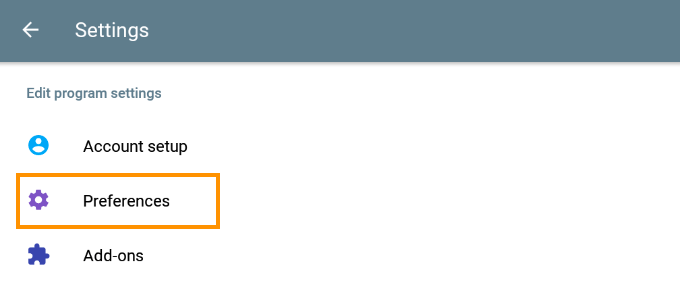

# Audio Configuration
For better audio quality it is recommended to use headphones or headsets.  

## Settings

**The following options can be adjusted:**

* `Echo Suppression / Echo cancellation`: This option can be deactivated if headphones are used
* `Noise Suppression`: In quiet environments without disturbing background noise, this option can also be deactivated.
* `Microphone Volume Boost / Microphone level`: If you are too quiet, this setting can be used to amplify your microphone.

## On iOS
1. Tap the `gear icon` at the top right.  

2. Tap on `Preferences`.  

3. Tap on `Sound`.  

4. To turn off a setting, move the green switch to the left.

5. Tap `Done` at the top right.  

## On Android
1. Tap the `dots` at the top right. Then tap on `Settings`.  

2. Tap on `Preferences`.  

3. Tap on `Sound`.  

4. To turn off a setting, move the green switch to the left.

5. Go back until you are at the main screen.  
