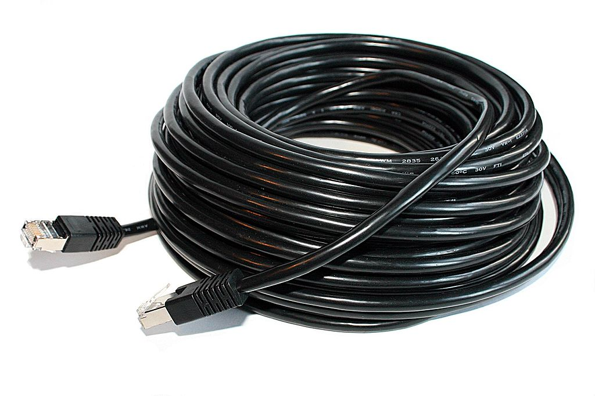
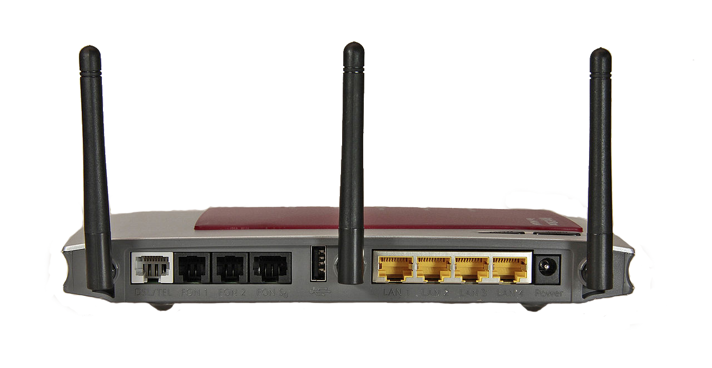

# Internet Access
To **remotely participate** in our podcast, a **stable internet connection** is required. 

To connect a device to the Internet, there are two frequently used options, but not all of them offer the same connection quality. In order to transmit audio without unwanted artifacts and distortion, a connection that is as stable as possible is recommended.

## Wired connections via ethernet (LAN)

Image from [BrunoAleixo](https://commons.wikimedia.org/wiki/File:Fritzbox_Fon_WLAN_7270_rueckseite.jpg) under [CC BY-SA 3.0 Unported](https://creativecommons.org/licenses/by-sa/3.0/deed.en).

A wired connection from your computer to your router is the best way to go, as it provides the most stable connection and therefore the best possible audio quality.

To connect your computer to the internet, plug in a LAN cable to your computer and to the LAN port of your router (may look slightly different).

Image from [Christian "VisualBeo" Horvat](https://commons.wikimedia.org/wiki/File:Patchcable_black_20m.jpg) under [CC BY-SA 3.0 Unported](https://creativecommons.org/licenses/by-sa/3.0/deed.en).

If you have network sockets at home, you can use them instead of connecting directly to your router.

Some computers, such as current MacBooks, may require an adapter for this connection (See [Thunderbolt to Gigabit Ethernet Adapter](https://www.apple.com/shop/product/MD463LL/A/thunderbolt-to-gigabit-ethernet-adapter), [USB-C to Gigabit Ethernet Adapter](https://www.apple.com/shop/product/HJKF2ZM/A/belkin-usb-c-to-gigabit-ethernet-adapter) or [USB Ethernet Adapter](https://www.apple.com/shop/product/MC704LL/A/apple-usb-ethernet-adapter)).

**Be sure to turn off WiFi on your computer during recording to ensure that the cable connection is used.**

## Wireless connections via WiFi (Wireless LAN)
If a wired connection is not possible, a connection via WiFi is also an option, but not recommended if somehow avoidable. 

Since your computer is probably already connected via WiFi if it is not using a cable, this step is not explained here. 
