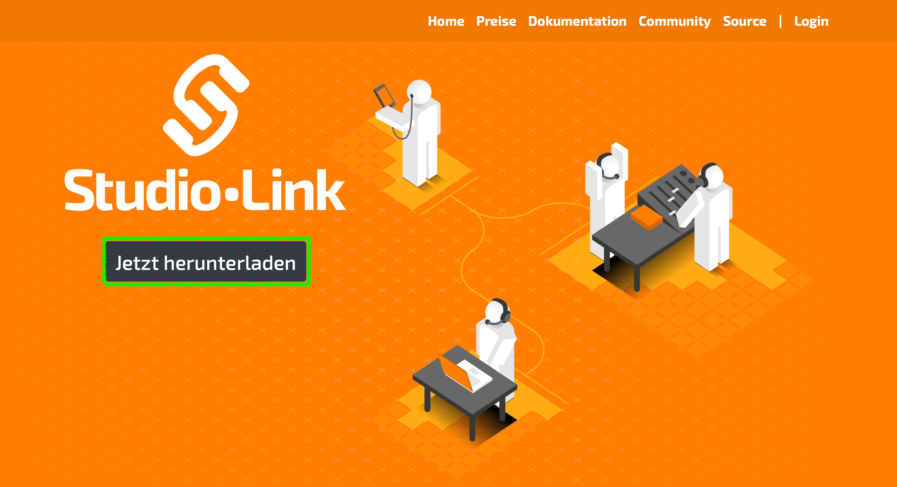
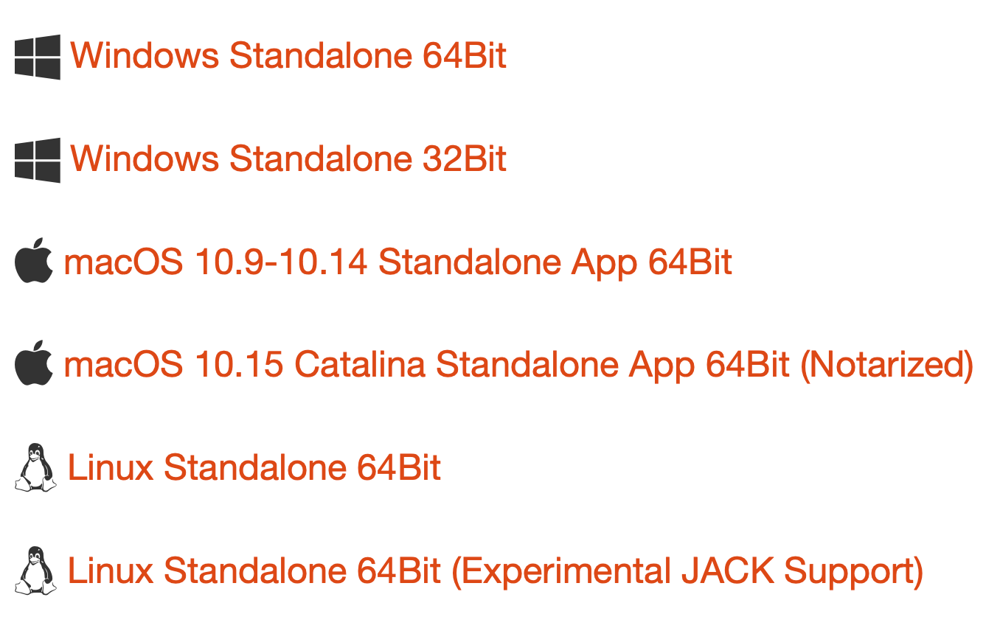
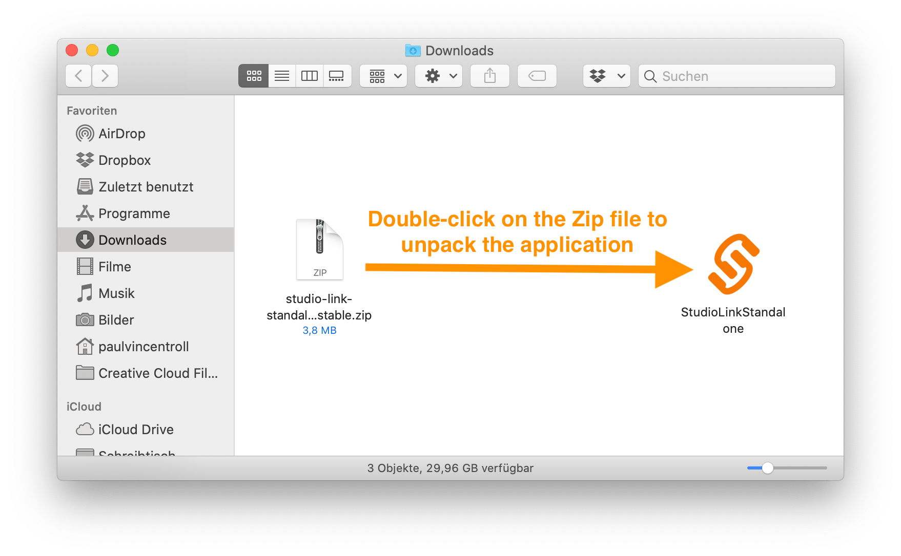

## Studio Link
We use Studio Link for the remote recording of our podcast, as it offers much better audio quality than other services that are not primarily intended for recording.

No account is required to use Studio Link, and it runs without requiring a permanent installation on your computer. 

### Download
The website of Studio Link is in German, but the software is completely in English.  
  
**Simply follow the steps below:**
1. Go to [studio-link.de](https://studio-link.de) and click on the Button `Jetzt herunterladen` (highlighted green).

2. Select the appropriate download for your computer.

3. Studio Link should now be in your download folder. Depending on your browser configuration, you may need to manually unzip the downloaded zip file under macOS. You can then delete the zip file afterwards.
